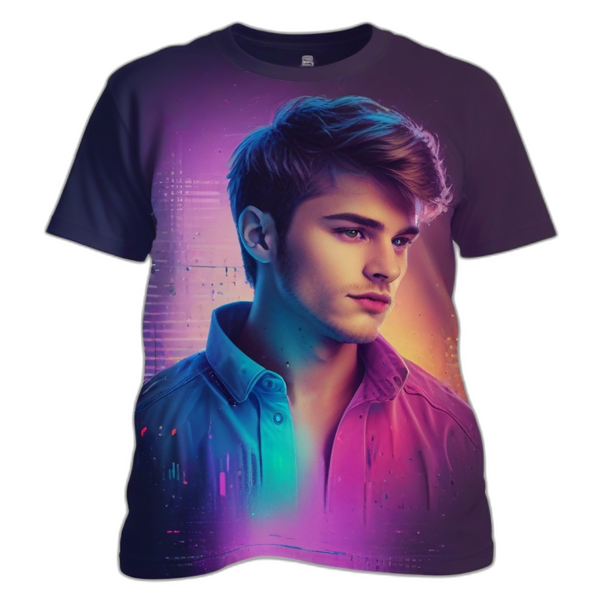
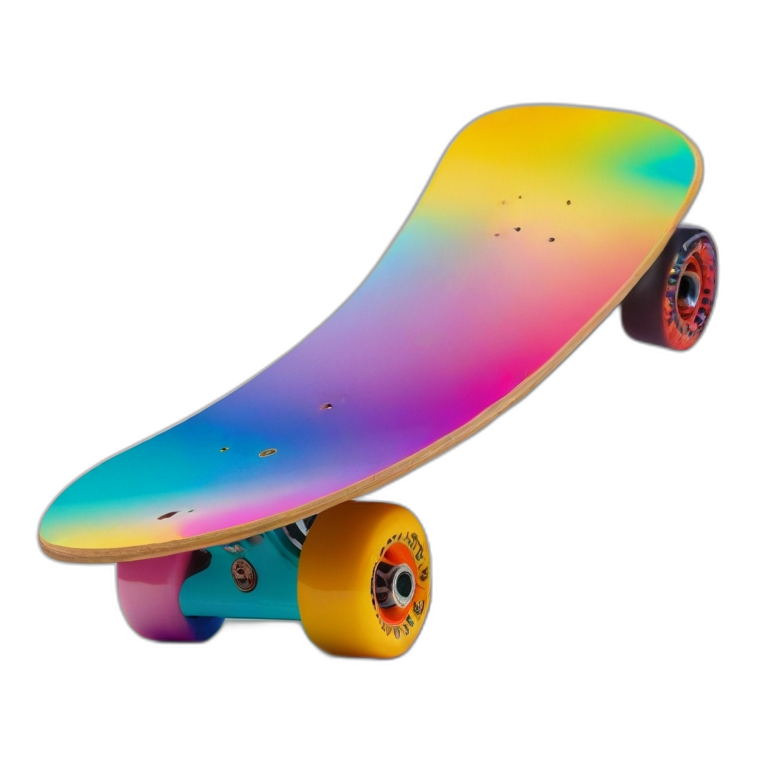

  <i
            class="ti ti-plus text-slate-500 absolute top-0 left-0 -translate-y-1/2 -translate-x-1/2"
            style="font-size: 30px"
          ></i>
          <i
            class="ti ti-plus text-sky-500 absolute bottom-0 left-0 translate-y-1/2 -translate-x-1/2"
            style="font-size: 30px"
          ></i>
          <i
            class="ti ti-plus text-sky-500 absolute top-0 right-0 -translate-y-1/2 translate-x-1/2"
            style="font-size: 30px"
          ></i>
          <i
            class="ti ti-plus text-sky-500 absolute bottom-0 right-0 translate-y-1/2 translate-x-1/2"
            style="font-size: 30px"
          ></i>

          style="
      background-color: #000000;
      background-image: repeating-linear-gradient(
          to right,
          transparent 0 49px,
          #eee1 49px 50px
        ),
        repeating-linear-gradient(
          to bottom,
          transparent 0 49px,
          #eee1 49px 50px
        );
    "

          <!-- 

        

          

          
Lorem ipsum dolor sit amet consectetur adipisicing elit. Laborum ipsam perspiciatis aliquam sunt vel! Ipsam nulla culpa distinctio nostrum expedita possimus quod qui, dolore, esse mollitia veritatis quibusdam voluptas labore?

          
Lorem ipsum dolor sit, amet consectetur adipisicing elit. Tempore a possimus suscipit nam, doloribus numquam sed animi mollitia architecto perferendis. Totam dolorem nam repellat repellendus! Aspernatur sit veniam quibusdam exercitationem?

          

        

      
 -->

      

          
<i class="text-red-500 text-5xl self-center ti ti-brand-html5"></i>

          

Oh! Come and see the violence inherent in the system! Help, help, I'm being repressed!

        

         

        

        

        

        

        

      

      

        

        

          

            
Video of Project:

            

              <input type="search" class="h-full w-full rounded-lg " name="" id="">
              <button class="text-white absolute top-0 rounded-r-lg right-0 px-6 bg-red-500 h-full"><i class="ti ti-search"></i></button>
           

          

          

            

              

                <video class="rounded-xl" src="./src/Video/1.mp4" controls autoplay></video>
              

              <i class="ti ti-heart text-3xl self-center text-white  ml-auto"></i>
            

            

              

                <video class="rounded-xl" src="./src/Video/2.mp4" controls autoplay></video>
              

              <i class="ti ti-heart text-3xl self-center text-white  ml-auto"></i>
            

            

              

                <video class="rounded-xl" src="./src/Video/3.mp4" controls autoplay></video>
              

              <i class="ti ti-heart text-3xl self-center text-white  ml-auto"></i>
            

            

              

                <video class="rounded-xl" src="./src/Video/4.mp4" controls autoplay></video>
              

              <i class="ti ti-heart text-3xl self-center text-white  ml-auto"></i>
            

          

        

      

      <!-- <a href="">
                    <i class="ti ti-brand-html5"></i>
                    HTML
                  </a>
                  <a href="">
                    <i class="ti ti-brand-css3"></i>
                    CSS
                  </a>
                  <a href=""><i class="ti ti-brand-typescript pr-2"></i>TypeScript</a>
                  <a href="">TailWindCss</a>
                  <a href="">Angular</a> -->

                  

        <picture>
          <source srcset="https://fonts.gstatic.com/s/e/notoemoji/latest/1f92b/512.webp" type="image/webp">
          
        </picture>
      

 

        

         
        
GGG

     

          

            <i class="ti ti-brand-youtube hover:text-sky-500 "></i>
            <a  href="https://github.com/DevelopPlus2024">
              <i class="ti ti-brand-github hover:text-sky-500"></i>
            </a>
            <a href="https://www.facebook.com/profile.php?id=61554760410819"><i class="ti ti-brand-facebook hover:text-sky-500 "></i></a>
            <i class="ti ti-brand-twitter hover:text-sky-500"></i>
            <i class="ti ti-brand-instagram hover:text-sky-500"></i>
            <i class="ti ti-brand-codepen hover:text-sky-500"></i>
          

          

            <a href="login.html"><button class="bg-white  text-black rounded-md px-8 py-1" style="font-family: MuseoModerno, sans-serif;">Login</button></a>
            <button class="rounded-md text-white button px-8 py-1 " style="font-family: MuseoModerno, sans-serif;">Sign Up</button>
          

 

      <button class=" fixed bottom-[1rem] left-1/2 -translate-x-1/2  text-md rounded-xl my-2  py-1 px-5 text-white"  style="background-color: #2e2e2e99;backdrop-filter: blur(40px);border: 1px solid gray;font-family: MuseoModerno, sans-serif;" >Deveploper 2024 Copyright © 2024 </button>
      
<i class="ti ti-message-chatbot text-white text-5xl"></i>

  
         

 <!DOCTYPE html>
<html lang="en">
  <head>
    <meta charset="UTF-8" />
    <meta name="viewport" content="width=device-width, initial-scale=1.0" />
    <title>ActSeLis</title>
    
    <link href="https://unpkg.com/aos@2.3.1/dist/aos.css" rel="stylesheet" />
    
    <link rel="stylesheet" href="./src/Css/style.css" />
    <link rel="preconnect" href="https://fonts.googleapis.com" />
    <link rel="preconnect" href="https://fonts.gstatic.com" crossorigin />
    <link rel="icon" href="./img/favicon.ico" type="image/x-icon">
    <link
      href="https://fonts.googleapis.com/css2?family=Poppins:ital,wght@0,100;0,200;0,300;0,400;0,500;0,600;0,700;0,800;0,900;1,100;1,200;1,300;1,400;1,500;1,600;1,700;1,800;1,900&family=Roboto+Mono:ital,wght@0,100..700;1,100..700&display=swap"
      rel="stylesheet" />
    <link
      rel="stylesheet"
      href="https://cdn.jsdelivr.net/npm/@tabler/icons-webfont@latest/dist/tabler-icons.min.css" />
    <link rel="preconnect" href="https://fonts.googleapis.com">
    <link rel="preconnect" href="https://fonts.gstatic.com" crossorigin>
    <link
      href="https://fonts.googleapis.com/css2?family=Noto+Sans:ital,wght@0,100..900;1,100..900&family=Poppins:ital,wght@0,100;0,200;0,300;0,400;0,500;0,600;0,700;0,800;0,900;1,100;1,200;1,300;1,400;1,500;1,600;1,700;1,800;1,900&family=Roboto+Mono:ital,wght@0,100..700;1,100..700&family=Roboto:ital,wght@0,100;0,300;0,400;0,500;0,700;0,900;1,100;1,300;1,400;1,500;1,700;1,900&display=swap"
      rel="stylesheet">
    <link rel="preconnect" href="https://fonts.googleapis.com">
    <link rel="preconnect" href="https://fonts.gstatic.com" crossorigin>
    <link
      href="https://fonts.googleapis.com/css2?family=Blinker:wght@100;200;300;400;600;700;800;900&family=Noto+Sans:ital,wght@0,100..900;1,100..900&family=Poppins:ital,wght@0,100;0,200;0,300;0,400;0,500;0,600;0,700;0,800;0,900;1,100;1,200;1,300;1,400;1,500;1,600;1,700;1,800;1,900&family=Roboto+Mono:ital,wght@0,100..700;1,100..700&family=Roboto:ital,wght@0,100;0,300;0,400;0,500;0,700;0,900;1,100;1,300;1,400;1,500;1,700;1,900&display=swap"
      rel="stylesheet">
    <link rel="stylesheet" type='text/css'
      href="https://cdn.jsdelivr.net/gh/devicons/devicon@latest/devicon.min.css" />
    <link rel="stylesheet"
      href="https://cdn.jsdelivr.net/npm/@tabler/core@1.0.0-beta17/dist/css/tabler-flags.min.css">
    <link rel="stylesheet"
      href="https://cdn.jsdelivr.net/npm/@tabler/core@1.0.0-beta17/dist/css/tabler-payments.min.css">
    <link rel="stylesheet"
      href="https://cdn.jsdelivr.net/npm/@tabler/core@1.0.0-beta17/dist/css/tabler-vendors.min.css">
    <link rel="preconnect" href="https://fonts.googleapis.com">
    <link rel="preconnect" href="https://fonts.gstatic.com" crossorigin>
    <link
      href="https://fonts.googleapis.com/css2?family=Blinker:wght@100;200;300;400;600;700;800;900&family=MuseoModerno:ital,wght@0,100..900;1,100..900&family=Noto+Sans:ital,wght@0,100..900;1,100..900&family=Poppins:ital,wght@0,100;0,200;0,300;0,400;0,500;0,600;0,700;0,800;0,900;1,100;1,200;1,300;1,400;1,500;1,600;1,700;1,800;1,900&family=Roboto+Mono:ital,wght@0,100..700;1,100..700&family=Roboto:ital,wght@0,100;0,300;0,400;0,500;0,700;0,900;1,100;1,300;1,400;1,500;1,700;1,900&display=swap"
      rel="stylesheet">

  </head>
  <body
    class="m-0 p-0 box-border relative "
    style="background-color: rgb(14, 13, 13);::-webkit-scrollbar-thumb {
      background-image: linear-gradient(-45deg, #6a5af9, #d66efd);
      border-radius: 10px;
  
  
    }">

    

      

      

      

        

          

            

              <!-- 

 -->

              

                

                

                  <a href="index.html"
                    class="hover:text-sky-500 font-medium transition duration-700 ease-in-out"
                    style="position: relative;font-family: MuseoModerno, sans-serif;">Home</a>
                  

                

                <a href="pricing.html"
                  class="hover:text-sky-500 font-medium ">Pricing</a>
                <a href="contact.html"
                  class="hover:text-sky-500 font-medium">Contact</a>
                <a href="aboutus.html"
                  class="hover:text-sky-500 font-medium">About Us</a>
                <a href="blog.html"
                  class="hover:text-sky-500 font-medium">Blog</a>
                <a href="feature.html"
                  class="hover:text-sky-500 font-medium">Feature</a>
                

                  

                    
Product

                    <i
                      class="ti ti-chevron-up originalClass text-white transition ease-in duration-300 "
                      id="myDiv"></i>
                  

                  

                  

                  

                    

                      

                      

                      

                      

                      

                      

                      

                      

                      

                      

                    

                  

                

                

                  

                    
Learn

                    <i class="ti ti-chevron-up originalClass text-white "
                      id="myDiv-2"></i>
                  

                  

                  

                  

                    

                      

                        
                        
Next Js.

                      

                      

                        
                        
React

                      

                      

                        
                        
Vue Js

                      

                      

                        
                        
TailWind Css

                      

                      

                        
                        
Angular

                      

                    

                  

                

              

            

            

              <a href="login.html"><button
                  class="bg-white  text-black rounded-md px-8 py-1"
                  style="font-family: MuseoModerno, sans-serif;">Login</button></a>
              <button class="rounded-md text-white button px-8 py-1 "
                style="font-family: MuseoModerno, sans-serif;">Sign Up</button>
            

          

        

      

      <main class=" h-screen relative">
        

          

            
My
              Name Is Developer Plus

            
            

Explore
                My Websites

          

          

        

        <!-- 

 -->
        <audio src="./src/Audio/y2mate.com1.mp3" class="hidden" autoplay
          controls loop></audio>

        <!-- 
My Name Is Develop Plus.
 -->
        

        

          <iframe width="560" height="315" class="rounded-2xl"
            src="https://www.youtube.com/embed/qthkkHPNAYQ?si=vToBWfCThXKgfqa1"
            title="YouTube video player" frameborder="0"
            allow="accelerometer; autoplay; clipboard-write; encrypted-media; gyroscope; picture-in-picture; web-share"
            referrerpolicy="strict-origin-when-cross-origin"
            allowfullscreen></iframe>
          <iframe id="videoPlayer" width="560" height="315" class="rounded-2xl"
            src="https://www.youtube.com/embed/K8xl96nOyF4?si=W43diGra4RPBHRlY"
            title="YouTube video player" frameborder="0"
            allow="accelerometer; autoplay; clipboard-write; encrypted-media; gyroscope; picture-in-picture; web-share"
            referrerpolicy="strict-origin-when-cross-origin"
            allowfullscreen></iframe>
        

        

          

            

              

                
                
The library for web and native user
                  interfaces. Next.js is built on the latest React features,
                  including Server Components and Actions.

              

            

          

          

            

              

                
                
The library for web and native user
                  interfaces. Next.js is built on the latest React features,
                  including Server Components and Actions.

              

            

          

          

            

              

                
                
The library for web and native user
                  interfaces. Next.js is built on the latest React features,
                  including Server Components and Actions.

              

            

          

        

        

          

            

              

                

                  
                  <h1 class="text-white text-sm">Michael Johnson</h1>
                

                

                  

                    <a href="https://github.com/DevelopPlus2024">
                      <i
                        class="ti ti-brand-github text-white text-xl hover:text-sky-500"></i>
                    </a>
                    <a
                      href="https://www.facebook.com/profile.php?id=61554760410819"><i
                        class="ti text-white text-xl ti-brand-facebook hover:text-sky-500 "></i></a>
                    <i
                      class="ti ti-brand-twitter text-white text-xl hover:text-sky-500"></i>
                  

                

              

              
With a background in software engineering
                and a knack for problem-solving, Michael is our go-to expert for
                developing robust backend solutions. His meticulous attention to
                detail ensures the stability and scalability of our
                projects.

            

            

              
              <h1 class="text-white">Emily Thompson:</h1>
              
As a user interface design specialist, Emily
                combines creativity with functionality, crafting visually
                stunning and intuitive user experiences. Her designs elevate our
                products, enhancing user engagement and satisfaction.

            

            

              
              <h1 class="text-white">Andrew Davis:</h1>
              
Andrew's expertise lies in data analysis and
                machine learning. With a keen analytical mind, he uncovers
                valuable insights from complex datasets, driving informed
                decision-making and optimization strategies.

            

            

              
              <h1 class="text-white">Sarah Wilson:</h1>
              
A mobile application development enthusiast,
                Sarah excels in creating responsive and feature-rich mobile
                apps. Her dedication to delivering seamless user experiences
                across various platforms is unparalleled.

            

            

              
              <h1 class="text-white">Sarah Wilson:</h1>
              
A mobile application development enthusiast,
                Sarah excels in creating responsive and feature-rich mobile
                apps. Her dedication to delivering seamless user experiences
                across various platforms is unparalleled.

            

            

              
              <h1 class="text-white">Sarah Wilson:</h1>
              
A mobile application development enthusiast,
                Sarah excels in creating responsive and feature-rich mobile
                apps. Her dedication to delivering seamless user experiences
                across various platforms is unparalleled.

            

            

              
              <h1 class="text-white">Sarah Wilson:</h1>
              
A mobile application development enthusiast,
                Sarah excels in creating responsive and feature-rich mobile
                apps. Her dedication to delivering seamless user experiences
                across various platforms is unparalleled.

            

            

              
              <h1 class="text-white">Sarah Wilson:</h1>
              
A mobile application development enthusiast,
                Sarah excels in creating responsive and feature-rich mobile
                apps. Her dedication to delivering seamless user experiences
                across various platforms is unparalleled.

            

            

              
              <h1 class="text-white">Sarah Wilson:</h1>
              
A mobile application development enthusiast,
                Sarah excels in creating responsive and feature-rich mobile
                apps. Her dedication to delivering seamless user experiences
                across various platforms is unparalleled.

            

            

              
              <h1 class="text-white">Sarah Wilson:</h1>
              
A mobile application development enthusiast,
                Sarah excels in creating responsive and feature-rich mobile
                apps. Her dedication to delivering seamless user experiences
                across various platforms is unparalleled.

            

            

              
              <h1 class="text-white">Sarah Wilson:</h1>
              
A mobile application development enthusiast,
                Sarah excels in creating responsive and feature-rich mobile
                apps. Her dedication to delivering seamless user experiences
                across various platforms is unparalleled.

            

            

              
              <h1 class="text-white">Sarah Wilson:</h1>
              
A mobile application development enthusiast,
                Sarah excels in creating responsive and feature-rich mobile
                apps. Her dedication to delivering seamless user experiences
                across various platforms is unparalleled.

            

          

        

        

          

          

          

            <button class="bg-white rounded-md px-4 py-2 selected"
              onclick="showContent('html')"
              style="font-family: MuseoModerno, sans-serif; font-weight: 300;">Html</button>
            <button class="bg-white rounded-md px-4 py-2"
              onclick="showContent('javascript')"
              style="font-family: MuseoModerno, sans-serif; font-weight: 300;">JavaScript</button>
            <button class="bg-white rounded-md px-4 py-2"
              onclick="showContent('tailwindcss')">TailWindCss</button>
            <button class="bg-white rounded-md px-4 py-2"
              onclick="showContent('css')">Css</button>
            <button class="bg-white rounded-md px-4 py-2"
              onclick="showContent('nextjs')">Next Js.</button>
          

          

            

              

                

                  <!-- 

 -->
                  
                  

                    
Show
                      Care Premium

                    

                      <button class="border px-4 py-2 rounded-md"
                        style="font-family: MuseoModerno, sans-serif; font-weight: 300;">HHH</button>
                      <button class="border px-4 py-2 rounded-md"
                        style="font-family: MuseoModerno, sans-serif; font-weight: 300;">HHH</button>
                    

                  

                

                

                  <!-- 

 -->
                  
                  

                    
Show
                      Care Premium

                    

                      <button class="border px-4 py-2 rounded-md"
                        style="font-family: MuseoModerno, sans-serif; font-weight: 300;">HHH</button>
                      <button class="border px-4 py-2 rounded-md"
                        style="font-family: MuseoModerno, sans-serif; font-weight: 300;">HHH</button>
                    

                  

                

                

                  <!-- 

 -->
                  
                  

                    
Show
                      Care Premium

                    

                      <button class="border px-4 py-2 rounded-md"
                        style="font-family: MuseoModerno, sans-serif; font-weight: 300;">HHH</button>
                      <button class="border px-4 py-2 rounded-md"
                        style="font-family: MuseoModerno, sans-serif; font-weight: 300;">HHH</button>
                    

                  

                

              

            

            
Nội dung của
              JavaScript

            
Nội dung của
              TailWindCss

            
Nội dung của Css

            
Nội dung của Next Js.

          

        

        

          

        

        
 

        

          

          

        

        

      </main>
      <footer class="p-6 ">
        <!-- 
Copyright by KandelFoxtion Inc
 -->
      </footer>
      
      
    </body>
  </html>
   

index.html :

				

				

   

							<video id="video_1" class="w-full ml-[34rem]   " controls autoplay src="./src/Video/video_4.mp4"></video>
							<video class="w-full  " controls autoplay src="./src/Video/video_12.mp4"></video>
						

						

							<button class="mt-[1rem] rounded-md bg-black text-white py-2 px-5" onclick="next_video()">Next</button>

